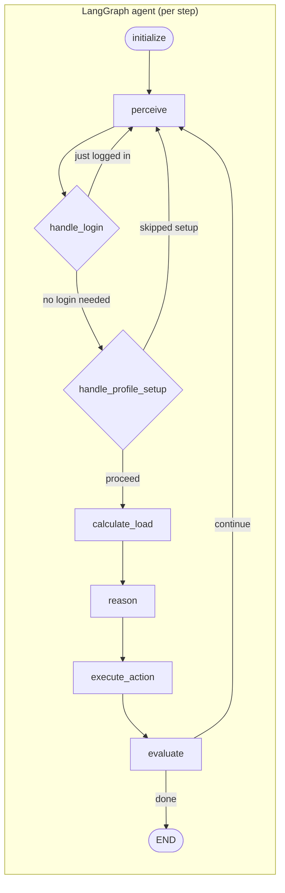
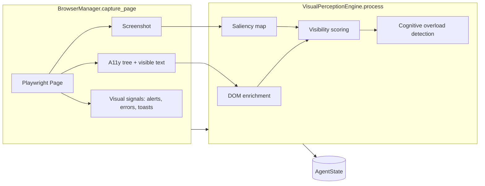
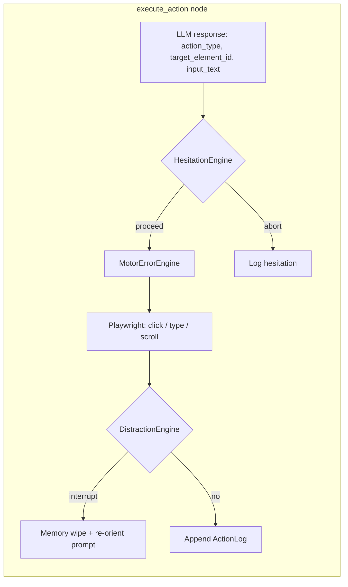
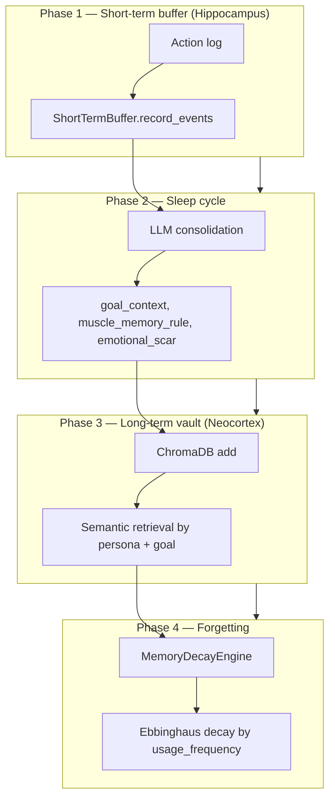

# Synthetic Swarm (Throngs)

AI-driven UX simulation engine that deploys LLM-powered autonomous agents (“personas”) into web applications. Agents exhibit human-like frustration, cognitive overload, and learning curves — and can either follow a given goal or **synthesize their own goal** from an “inner voice” (Autonomous Executive Function). Outputs include actionable UX feedback, heatmaps, and report cards.

---

## Complete flow (high level)

```mermaid
flowchart TB
    subgraph CLI["throngs (CLI)"]
        A[Parse --url, --goal?, --personas, etc.]
        A --> B{--single?}
        B -->|yes| C[Run one persona]
        B -->|no| D[Run swarm]
    end

    subgraph Runner["Runner (run_single_agent / run_swarm)"]
        C --> E[Load persona(s), credentials]
        D --> E
        E --> F{Goal provided?}
        F -->|no| G[Executive: synthesize_goal]
        F -->|yes| H[Use --goal]
        G --> I[Start browser, goto start_url]
        H --> I
        I --> J[Build LangGraph agent]
        J --> K[Stream graph until outcome or max_steps]
        K --> L[SimulationResult(s)]
    end

    subgraph Post["After run (swarm only)"]
        L --> M[HeatmapGenerator]
        M --> N[ReportGenerator]
        N --> O[Traces + reports on disk]
    end

    CLI --> Runner
    Runner --> Post
```

- **CLI** (`main.py`): Parses args, loads personas, then calls either `run_single_agent` or `run_swarm`.
- **Runner** (`runner.py`): If no goal is given, calls `throngs.executive.synthesize_goal()` (persona + start URL → one LLM call for inner voice + actionable goal). Then starts a browser, builds the agent graph, and runs it until success/failure/max steps.
- **Post-run (swarm)**: Heatmaps from action logs, LLM-synthesized report, and trace files under `output/`.

---

## Single-agent execution loop (LangGraph)

Each agent runs a **state machine** implemented in `throngs/graph/agent.py`. State is `AgentState` (persona, goal, URLs, screenshot, a11y tree, frustration, memory prompt, action log, etc.). One iteration = one “step” (perceive → maybe login/profile-setup → calculate_load → reason → execute_action → evaluate).



| Node | Role |
|------|------|
| **initialize** | Set run_id, session_dir; load **memory** (recall + build memory_prompt for this persona/goal). |
| **perceive** | **BrowserManager** captures page (screenshot + a11y + visible text + visual signals). **VisualPerceptionEngine** runs (saliency, visibility, overload). State gets screenshot_b64, a11y_elements, visible_text, page_title, visual_overload, visual_signals. |
| **handle_login** | If page looks like login and persona has credentials → fill and submit; then re-perceive. |
| **handle_profile_setup** | If page looks like profile/phone/passkey setup → click Skip/Not now; then re-perceive. |
| **calculate_load** | **FrustrationEngine** computes frustration from clutter, jargon, loops, overload; updates cumulative_frustration. |
| **reason** | **Vision LLM** gets system prompt (persona + goal + memory) and user message (URL, title, frustration, action history, page signals, a11y tree, visible text, **screenshot**). Returns internal_monologue, action_type, target_element_id, input_text, task_completed, session_notes. |
| **execute_action** | Resolve element, apply **HesitationEngine** (risk-averse checks), **MotorErrorEngine** (misclicks, typos), **DistractionEngine** (chaos-monkey interruptions). Playwright click/type/scroll. Append **ActionLog** to state. |
| **evaluate** | If task_completed or give_up or rage_quit or max_steps → outcome success/failure, run **memory** sleep cycle, END. Else → continue to perceive. |

---

## Perception pipeline (per step)

Within **perceive**, the pipeline is:



- **Capture**: Screenshot (base64 + file), list of interactive elements (role, name, bounds, colors), visible text, and visual signals (alerts/validation/toasts).
- **Retina**: Enrichment, saliency, visibility vs. goal, and overload (clutter note, distraction note). Result is written into `AgentState` for **reason** and **calculate_load**.

---

## Execute-action pipeline (motor, hesitation, distraction)

Inside **execute_action**, before and after the actual Playwright action:



- **HesitationEngine**: On high-stakes actions (e.g. financial), may inject a verification step or abandon (persona risk_tolerance).
- **MotorErrorEngine**: Applies persona motor_precision (misclicks), typo_rate; can simulate fat-finger and recovery.
- **DistractionEngine**: After some actions (e.g. post-login), may trigger a “coffee break”: wipe working context and inject a re-orientation prompt next step.

---

## Memory system (four-phase)

When a run ends (success/failure), **evaluate** calls **CognitiveMemoryStore.run_sleep_cycle**. High-level flow:



- **Recall** (at **initialize**): Memory store returns relevant past memories for this persona/goal (decay applied); these are turned into `memory_prompt` for the **reason** node.
- **Consolidation**: One LLM call turns the raw action log into a few sentences (goal_context, muscle_memory_rule, emotional_scar) and stores them in ChromaDB.

---

## Package layout

| Package / module | Purpose |
|------------------|--------|
| **throngs/main.py** | CLI entry; argparse, load personas, call runner. |
| **throngs/runner.py** | `run_single_agent`, `run_swarm`; optional goal synthesis; build graph; run until done; heatmaps + reports (swarm). |
| **throngs/executive/** | **Autonomous Executive Function**: `internal_state`, `world_state`, `synthesize_goal`, `decompose_goal`, `GoalSynthesisResult`. Used when `--goal` is omitted. |
| **throngs/graph/** | **LangGraph**: `AgentState`, `build_agent_graph`, and all nodes (initialize, perceive, handle_login, handle_profile_setup, calculate_load, reason, execute_action, evaluate). |
| **throngs/perception/** | **BrowserManager** (Playwright, capture_page), a11y extraction, **VisualPerceptionEngine** (saliency, visibility, overload). |
| **throngs/persona/** | **PersonaEngine**: load personas JSON, credentials; build_system_prompt_fragment. |
| **throngs/frustration/** | **FrustrationEngine**: cognitive load, jargon, loops, overload; should_rage_quit. |
| **throngs/memory/** | **CognitiveMemoryStore**: buffer, sleep cycle (consolidation), ChromaDB vault, decay. |
| **throngs/motor/** | **MotorErrorEngine**: misclicks, typos (persona motor_precision, typo_rate). |
| **throngs/hesitation/** | **HesitationEngine**: risk-aversion checks on sensitive actions. |
| **throngs/distraction/** | **DistractionEngine**: chaos-monkey interruptions, memory wipe, re-orient prompt. |
| **throngs/analytics/** | **HeatmapGenerator**, **ReportGenerator** (LLM UX report card). |
| **throngs/config.py** | Settings (env prefix `SWARM_`): LLM, browser, perception, memory decay, etc. |
| **throngs/schemas.py** | Pydantic models: PersonaDNA, ActionLog, LLMResponse, AgentState fields, etc. |

**Diagrams:** [docs/throngs-overview.excalidraw.json](docs/throngs-overview.excalidraw.json) — Excalidraw-style overview (six pillars, agent loop, CLI → Runner → Output). Open in [Excalidraw](https://excalidraw.com) (paste JSON or drag file).

---

## Setup

```bash
# Install dependencies
poetry install

# Install Playwright browsers
poetry run playwright install chromium

# Configure environment
cp .env.example .env
# Edit .env with your API key(s)
```

---

## Usage

### Run a full swarm (shared goal)

```bash
poetry run throngs \
  --url "https://staging.example.com/dashboard" \
  --goal "Find and create a new invoice" \
  --personas personas/default_personas.json
```

### Run with autonomous goal (no --goal)

When `--goal` is omitted, each agent gets a **goal chain** synthesized from the persona and start URL: an ordered list of 3–8 realistic business tasks (e.g. *check bank balance and cashflow → create purchase order for pens → pay the invoice*). The agent works through the chain step by step and only exits when all tasks are done, so the run reflects a full business use case instead of a single goal.

```bash
poetry run throngs \
  --url "https://staging.example.com/dashboard" \
  --personas personas/default_personas.json
```

### Run a single persona

```bash
poetry run throngs \
  --url "https://staging.example.com/dashboard" \
  --goal "Find the profit and loss report" \
  --personas personas/default_personas.json \
  --single "Martha_Bookkeeper" \
  --verbose
```

### Options

| Flag | Description | Default |
|------|-------------|--------|
| `--url` | Starting URL to test | *(required)* |
| `--goal` | Goal for agents; if omitted, synthesized per persona | *optional* |
| `--personas` | Path to personas JSON file | *(required)* |
| `--max-steps` | Max steps per agent | `50` |
| `--max-concurrent` | Max concurrent browser sessions (swarm) | from config |
| `--single` | Run a single persona by name | *(all)* |
| `--credentials` | Path to credentials JSON (persona → email/password) | optional |
| `--company` | Company key in credentials (use `?` to list) | optional |
| `--dashboard-url` | Push real-time state to dashboard (SSE) | optional |
| `--relations` | Path to throng relationship graph (JSON/YAML) | optional |
| `--verbose` / `-v` | Debug logging | off |

---

## Real-time dashboard (Sims-style)

Visualize the agent’s state live: **thought** (internal monologue), **decision** (action + target), **location** (URL, page title), **frustration** and **patience** bar, **memory snapshot**, and **session notes**. The dashboard is SSE-based: the runner POSTs state after each graph node; the browser subscribes via EventSource.

**1. Start the dashboard server** (in one terminal):

```bash
throngs dashboard --port 8765
```

Open **http://127.0.0.1:8765** in your browser.

**2. Run an agent with streaming** (in another terminal):

```bash
throngs --url "https://staging.example.com" \
  --personas personas/default_personas.json \
  --single "Martha_Bookkeeper" \
  --dashboard-url http://127.0.0.1:8765
```

The dashboard updates in real time as the agent perceives, reasons, and acts. Architecture:

- **Server**: FastAPI app with `GET /stream` (SSE) and `POST /event` (receive snapshot, broadcast to all clients).
- **Runner**: After each LangGraph node, builds a snapshot (`throngs.dashboard.snapshot.build_snapshot`) and POSTs to `dashboard_url/event` when `--dashboard-url` is set.
- **Frontend**: Single HTML page using `EventSource("/stream")` and a Sims-inspired layout (thought bubble, need bars, location, memory panel).

---

## Persona configuration

Personas are JSON arrays. Each persona has:

```json
{
  "name": "Martha_Bookkeeper",
  "description": "58-year-old bookkeeper...",
  "domain_literacy": 8,
  "tech_literacy": 3,
  "patience_budget": 15,
  "trigger_words": ["API", "integration", "sync"],
  "friendly_words": ["invoice", "payment", "customer"]
}
```

- **domain_literacy** (1–10): Understanding of domain (e.g. accounting) jargon.
- **tech_literacy** (1–10): Comfort with web UI patterns.
- **patience_budget** (int): Effective “rage quit” threshold (frustration vs. budget).
- **trigger_words**: Terms that increase anxiety/frustration.
- **friendly_words**: Terms the persona looks for and trusts.
- Optional: **usage_device** (`desktop` | `mobile`), **motor_precision**, **typo_rate**, **risk_tolerance**, **interruption_probability** for motor/hesitation/distraction.

---

## Throng relations (inter-dependent throngs)

Throngs can depend on each other in **roles** (e.g. one throng is the accountant for another, or the delivery partner). When you pass a **relations graph**, goal synthesis gets context like: *"You are ThrongY; you act as accountant for FurnitureRetail; you depend on ThrongA for vehicle_owner."*

**1. Define a relationship graph** (JSON or YAML):

- **throngs**: list of `{ id, label?, persona_id? }`. `persona_id` links this throng to a persona by name (so that persona runs as this throng).
- **relationships**: list of `{ owner_id, role, provider_id }`. Meaning: *owner* depends on *provider* in *role* (e.g. FurnitureRetail has ThrongY as accountant).

**Roles** (see `ThrongRole` in `throngs/schemas.py`): `accountant`, `admin`, `assistant`, `bookkeeper`, `supplier`, `vendor`, `delivery`, `vehicle_owner`, `parking_vendor`, `client`, `customer`, `other`.

Example (`personas/relations_example.json`):

```json
{
  "throngs": [
    { "id": "FurnitureRetail", "label": "Furniture Retail" },
    { "id": "ThrongY", "label": "Bookkeeping & supply", "persona_id": "Martha_Bookkeeper" },
    { "id": "ThrongZ", "label": "Delivery operator" },
    { "id": "ThrongA", "label": "Vehicle owner" },
    { "id": "ThrongB", "label": "Parking vendor" }
  ],
  "relationships": [
    { "owner_id": "FurnitureRetail", "role": "accountant", "provider_id": "ThrongY" },
    { "owner_id": "FurnitureRetail", "role": "delivery", "provider_id": "ThrongZ" },
    { "owner_id": "ThrongZ", "role": "accountant", "provider_id": "ThrongY" },
    { "owner_id": "ThrongZ", "role": "vehicle_owner", "provider_id": "ThrongA" },
    { "owner_id": "ThrongZ", "role": "parking_vendor", "provider_id": "ThrongB" }
  ]
}
```

**2. Run with `--relations`:**

```bash
throngs --url "https://app.example.com" \
  --personas personas/default_personas.json \
  --relations personas/relations_example.json \
  --single "Martha_Bookkeeper"
```

Martha_Bookkeeper is linked to ThrongY; ThrongY is accountant for FurnitureRetail and for ThrongZ. That context is injected into goal synthesis so the agent’s goal can reflect its role in the network.

**API:** `ThrongGraph.load_json(path)`, `load_throng_graph(path)`, `graph.context_for_throng(throng_id)`, `graph.throng_id_for_persona(persona_name)`.

---

## Output

After a run, the `output/` directory (configurable) contains:

```
output/
├── screenshots/<run_id>/<persona>/   # Per-step screenshots
├── heatmaps/<run_id>/                # Frustration-coloured click overlays
├── reports/<run_id>/                 # UX report (markdown + JSON)
└── traces/<run_id>/                 # Per-persona trace JSON + _summary.json
```

---

## Environment variables

See `.env.example`. Key variables (prefix `SWARM_`):

- `SWARM_LOCAL_BASE_URL` — Local LLM API base URL (default: http://localhost:4000)
- `SWARM_LOCAL_MODEL` / `SWARM_LOCAL_VISION_MODEL` — Default and vision model names
- `SWARM_LOCAL_MODEL_FAST` — Fast model for goal synthesis / task decomposition
- `SWARM_CONSOLIDATION_MODEL` — Model for memory sleep cycle
- `SWARM_MAX_CONCURRENT_AGENTS` — Concurrency limit
- `SWARM_BROWSER_HEADLESS` — Run browsers headless (default: false in config)
- `SWARM_CHROMADB_PERSIST_DIR` — ChromaDB path for memory vault

**Per-task model overrides** (optional): assign a different local model per task.

- `SWARM_MODEL_GOAL_SYNTHESIS` — Executive Level 1 (default: local_model_fast)
- `SWARM_MODEL_REASON` — Graph reason node (default: local_vision_model)
- `SWARM_MODEL_REPORT` — UX report (default: local_model)
- `SWARM_MODEL_TASK_DECOMPOSITION` — Executive Level 2 (default: local_model_fast)

---

## Programmatic API

```python
import asyncio
from throngs.runner import run_swarm, run_single_agent
from throngs.schemas import PersonaDNA

personas = [
    PersonaDNA(
        name="TestUser",
        domain_literacy=5,
        tech_literacy=5,
        patience_budget=20,
    ),
]

# With explicit goal
report = asyncio.run(
    run_swarm(
        personas=personas,
        goal="Create a new invoice",
        start_url="https://staging.example.com",
    )
)

# With synthesized goal (omit goal)
report = asyncio.run(
    run_swarm(
        personas=personas,
        goal=None,
        start_url="https://staging.example.com",
    )
)

print(report.report_markdown)
```

Single agent, optional goal:

```python
result = asyncio.run(
    run_single_agent(
        persona=personas[0],
        goal=None,  # synthesized from persona + start_url
        start_url="https://staging.example.com",
    )
)
print(result.outcome, result.total_steps, result.goal)
```

---

## Specs

- **Autonomous Executive Function** (`specs/2_Throngs - Autonomous Executive Function.md`): Goal-free autonomy; internal state, world state, goal synthesis (Level 1), task decomposition (Level 2). Implemented in `throngs.executive` and consumed by the runner when `--goal` is omitted.
